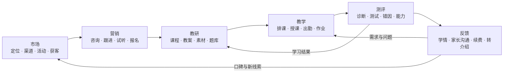
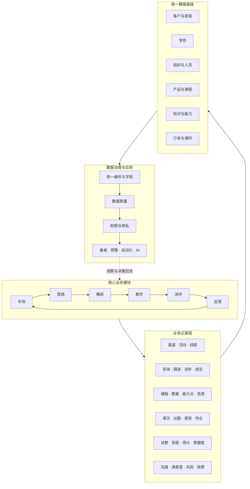
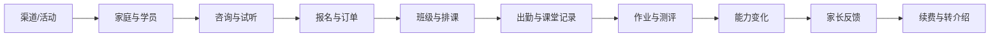

# 英语培训机构工作提效

本项目用于梳理英语培训机构的核心业务、统一数据基座，并逐步建设可复用的标准流程、自动化工具与 AI 工作流。

## 一、总体目标

围绕学员全生命周期，打通：

**市场获客 → 营销转化 → 教研生产 → 教学交付 → 测评诊断 → 反馈增值**

目标不是零散增加工具，而是建立一套可持续迭代的机构运营系统：

- 业务流程可追踪
- 数据口径统一
- 教学成果可衡量
- 家长价值可感知
- 重复工作可自动化
- 关键决策有数据支持

## 二、核心业务闭环

## 三、业务与数据统一架构

## 四、核心主数据

| 数据对象 | 唯一标识 | 主要用途 |
| --- | --- | --- |
| 家庭/客户 | 家庭 ID | 统一管理联系人、渠道和家庭关系 |
| 学员 | 学员 ID | 串联咨询、报名、教学、测评和续费 |
| 家长 | 家长 ID | 记录关系、联系方式和沟通偏好 |
| 教师/员工 | 人员 ID | 关联组织、班级、课次与责任 |
| 课程产品 | 课程 ID | 定义级别、课时、价格和学习目标 |
| 班级 | 班级 ID | 关联课程、学员、教师和排课 |
| 知识/能力点 | 能力点 ID | 串联教材、教学目标、题目和测评 |
| 渠道 | 渠道 ID | 衡量获客成本和后续转化质量 |

核心原则：每个对象只有一个唯一编号，各业务模块引用同一份主数据。

## 五、关键数据链路

系统最终需要回答：

> 某个渠道带来的哪位学员，购买了什么课程，由谁教学，学习效果如何，家长是否满意，最后是否续费或转介绍。

## 六、建设顺序

### 第一阶段：经营链路

- 家庭与学员主档案
- 渠道与线索
- 咨询、跟进和试听
- 报名、订单和班级
- 基础经营指标

### 第二阶段：教学链路

- 课程、教材与能力点
- 排课、课次和出勤
- 课堂表现与作业
- 测评、错题和能力诊断
- 教学质量指标

### 第三阶段：价值闭环

- 自动生成学情反馈
- 家长沟通记录
- 满意度和风险预警
- 续费与流失分析
- 转介绍和口碑回流

## 七、优先落地项目

1. 建立学员全生命周期数据字典
2. 设计机构统一学员台账
3. 建立教材拆解与课程数据结构
4. 自动生成课堂记录和家长反馈
5. 建设经营、教学和续费看板
6. 将稳定流程封装为机构专用 Codex Skills

## 八、当前共识

- 六个业务模块构成一个循环，而不是六套孤立工作。
- 业务行为应形成结构化记录，并沉淀到统一数据基座。
- 教学成果和家长感知必须回流到续费、转介绍和市场口碑。
- 先统一对象、字段、状态和指标口径，再建设自动化与 AI。
- AI 负责提高执行效率，人负责教学判断、关系维护和关键决策。

## 九、下一步

下一步优先梳理“学员全生命周期数据字典”，明确：

- 数据对象
- 字段名称和定义
- 唯一编号规则
- 对象之间的关系
- 数据产生环节
- 责任人与更新频率
- 权限和隐私要求
- 核心指标计算口径

## 十、设计文档

- [GitHub协作与发布规范](docs/github-collaboration-workflow.md)：固定提交范围、安全预检、验证、提交、推送、PR和接力方法。
- [数据库内容操作规范](database/operations/README.md)：固定root结构操作、读写账号脚本执行和本机审计留痕。
- [Cyana最小教学数据基座：采纳建议](docs/cyana-data-foundation-adoption-brief.md)：面向机构负责人的一页式方案摘要、验证证据和两周试点建议。
- [Cyana教学-反馈数据基座采纳建议PDF](output/pdf/cyana-data-foundation-adoption-brief.pdf)：适合向机构负责人展示和转发的六页正式版本。
- [2026-08-03工作小结与接力说明](docs/2026-08-03-work-handoff.md)：记录数据库现状、ER验证方法、模拟结果、修复记录和后续操作入口。
- [测评与反馈最小数据模型](docs/assessment-feedback-minimal-data-model.md)：使用最小化建表原则、ER 关系图、字段数据字典和指标血缘矩阵，论证测评与反馈的数据结构。
- [测评与反馈数据设计完整交互版](docs/assessment-feedback-data-design.html)：支持一版看全，以及结构关系、字段字典、指标验证和学员实例分层阅读。
- [最小数据基座ER论证](docs/minimal-data-foundation-er.html)：压缩为10张业务表加1张结构治理表，并说明PDF验证、压缩下限与未来拆表条件。
