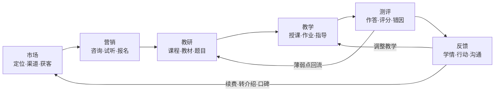
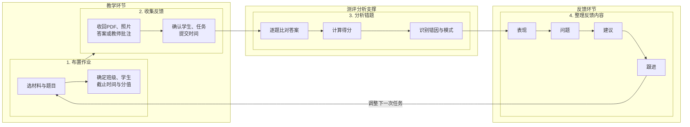
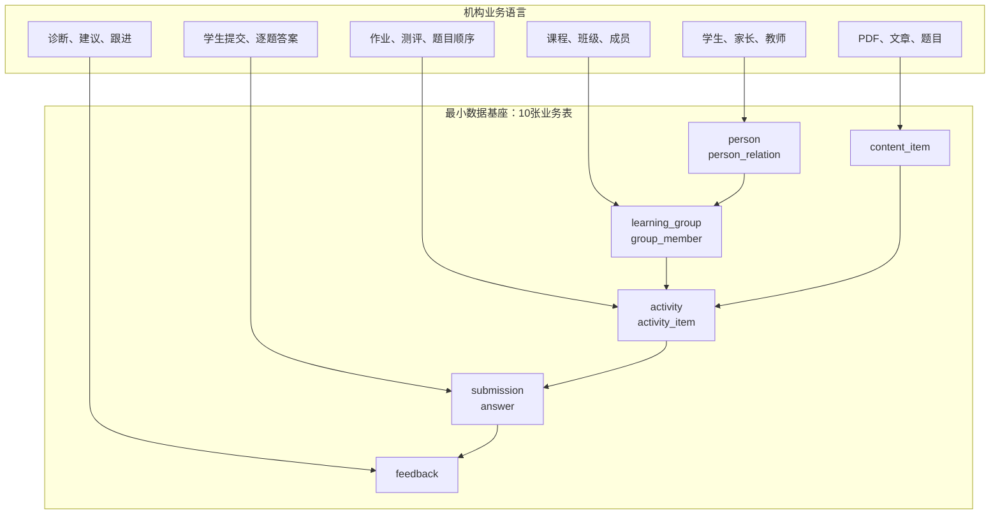
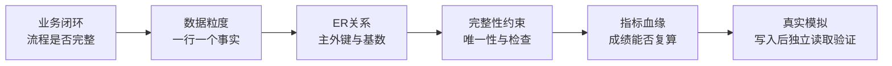
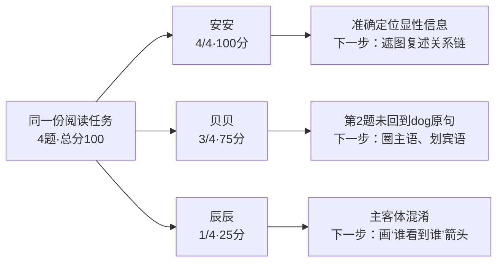

# Cyana教学—反馈数据基座：采纳建议

## 一句话建议

建议用一个班级开展两周试点：把“布置作业—收集作答—分析错题—整理反馈”沉淀为统一数据，再依据真实效果决定扩展范围。

## 一、我们对机构整体运作的理解

英语培训机构不是六套孤立工作，而是一个从获客到口碑回流的闭环：

本阶段不试图一次建设完整经营系统，而是先深挖负责人最容易感知价值的“教学”和“反馈”两个环节；中间的测评分析作为连接二者的能力支撑。

## 二、教学—反馈的四个实际子环节

这里的“收集反馈”指收回学生作答、老师批改痕迹及必要的课堂观察，避免与最终反馈报告混淆。

人在流程中负责确认学生身份、正式成绩和教学判断；系统负责整理材料、保存事实、复算成绩并形成反馈草稿。

## 三、如何把复杂流程抽象成最小数据结构

我们的抽象原则不是“每个动作建一张表”，而是识别稳定的业务事实：谁、在哪个学习组织、使用什么内容、完成什么任务、提交什么答案、得到什么反馈。

核心关系、状态、时间、顺序和分值使用标准字段；选项、量规、联系方式和低频属性放入JSON。这样既控制表数量，又能承载未来大量材料、答题和反馈信息。

## 四、为什么这个抽象可信

本方案已经在 MySQL 8.4 中实际建库、建表并设置读写隔离。验证过程中发现并修复了标识符和外键检查约束问题，说明它接受过真实数据库检验，而非停留在概念图。

## 五、三个学生的模拟输出

采用 Level D 阅读材料 “Look Out!”：4道选择题，标准答案为 B/A/B/A。

实际生成的简洁反馈：

| 序号 | 学生 | 表现 | 问题 | 建议与跟进 |
| ---: | --- | --- | --- | --- |
| 1 | 安安（模拟） | 4题全对，关系链清楚 | 本次无明显错误 | 遮住图片复述关系链，再做1篇无图片提示阅读 |
| 2 | 贝贝（模拟） | 3题能正确定位 | 相似选项下凭印象作答 | 圈出主语dog，回原文划出宾语cat；补做2组配对题 |
| 3 | 辰辰（模拟） | 第4题能正确定位 | 前3题主客体混淆，部分选择脱离原文 | 逐句画dog→cat等箭头；教师带读后完成4道同结构题 |

数据库中已保存3次提交、12条逐题答案和3份反馈；三名学生的总分与逐题汇总差值均为0。

## 六、机构可以获得什么

1. 教师少做重复整理，反馈直接指向具体错题和下一步行动。
2. 教研可以识别高频错因、材料难度和需要调整的教学内容。
3. 负责人可以追踪作业完成、评分一致性和反馈及时性。
4. 家长收到的不只是分数，而是“表现—问题—建议—跟进”。
5. 数据持续积累后，可以分析个人进步、班级共性和材料有效性，无需推翻当前结构。

## 七、边界与风险控制

- AI不擅自判断学生身份、班级和正式成绩；缺少关键归属时主动请教师补充。
- 日常读写账号不能修改表结构，结构变更必须由治理账号执行并验证。
- 原始材料、识别结果、教师确认和对外反馈需要保持可追溯。
- 当前优先解决教学反馈闭环，不宣称一次替代CRM、财务或完整排课系统。

## 八、建议的两周试点

| 阶段 | 动作 | 判断标准 |
| ---: | --- | --- |
| 第1周 | 选择1名教师、1个班、3至10名学生，登记2次作业 | 材料和答题可完整登记，教师能理解反馈 |
| 第2周 | 持续登记，由教师确认和修改反馈 | 记录处理耗时、教师修改率和遗漏信息 |
| 复盘 | 对比原流程 | 反馈更及时、更具体，教师负担下降 |

需要负责人批准：指定试点教师和班级，允许使用经授权或脱敏的学生作业，两周后依据数据质量、教师耗时和反馈价值决定是否扩大。

**采纳核心：我们先理解流程，再把复杂流程抽象成可验证的数据事实；先用最小结构跑通真实闭环，再由真实需求推动扩展。**
